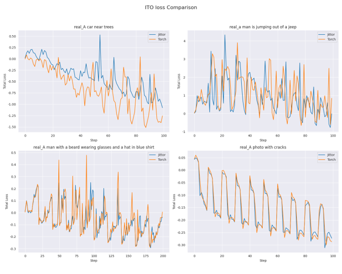
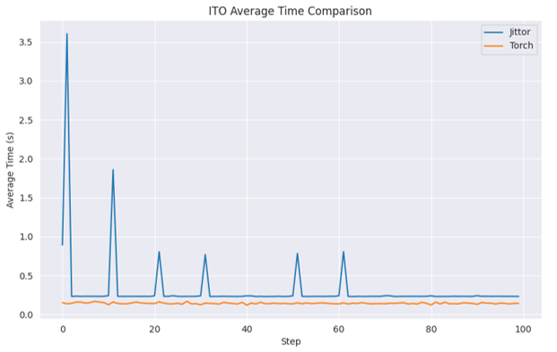
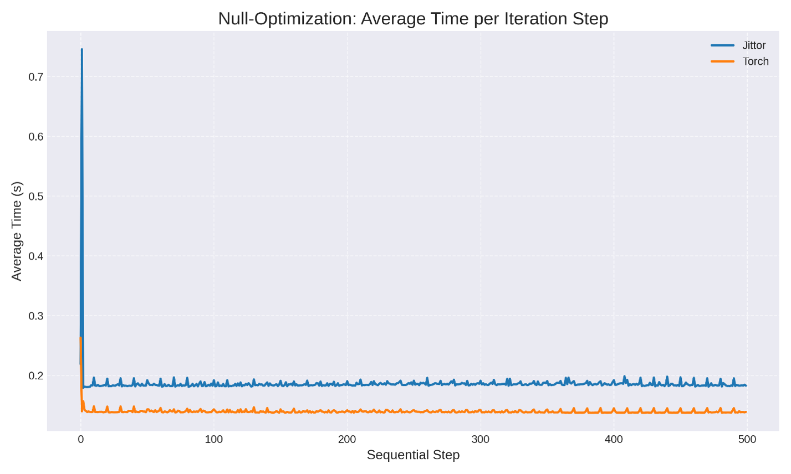
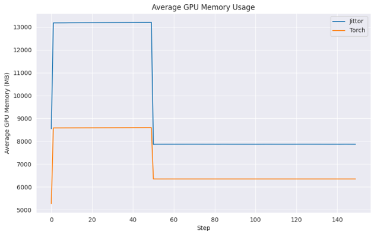
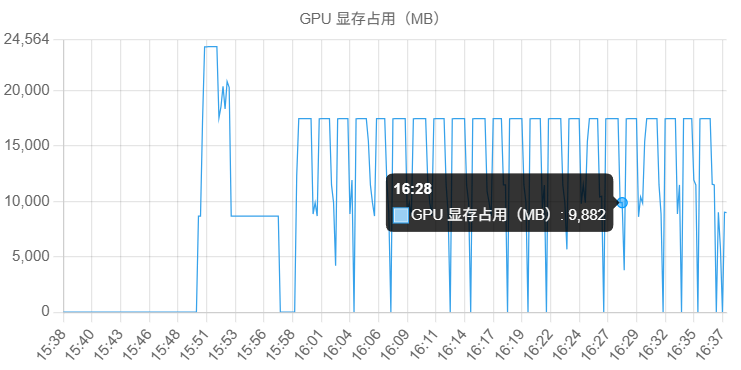
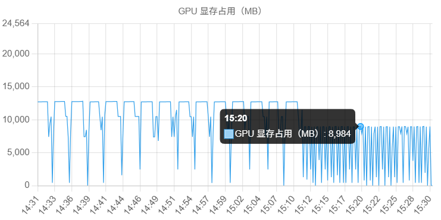

# SuppressEOT-Jittor

   

##  项目简介

本项目基于 [GET WHAT YOU WANT, NOT WHAT YOU DON’T: IMAGE CONTENT SUPPRESSION FOR TEXT-TO-IMAGE DIFFUSION MODELS](https://arxiv.org/abs/2402.05375) 论文和[原 pytorch 项目](https://github.com/sen-mao/SuppressEOT)，使用 Jittor 框架复现了SuppressEOT算法的完整流程。该项目旨在：

-  使用 Jittor 框架复现原始算法
-  对比Jittor和Torch代码的处理速度和loss变化、显存占用等指标

##  环境配置

- 硬件环境

  - RTX 4090(24GB)

- 软件环境

  - Ubuntu 22.04
  - Python 3.12

  - CUDA 12.6
  - CUDNN 8.9.7
  - CPU：AMD EPYC 7453, 14 vCPU
  - 内存：64 GB

- 框架版本

  - Jittor 1.3.9.14
  - PyTorch 2.6.0 (cu126)
    - torchvision 0.21.0 (cu126)
    - torchaudio 2.6.0 (cu126)

---

### Jittor环境配置

使用 Conda 创建虚拟环境（注：Jtorch和JDiffusion会劫持对torch的调用，建议环境配置在$HOME下以确保成功）

```bash
wget https://repo.anaconda.com/miniconda/Miniconda3-latest-Linux-x86_64.sh -O miniconda.sh
bash miniconda.sh -b -p $HOME/miniconda3
$HOME/miniconda3/bin/conda init bash
source ~/.bashrc

conda tos accept --override-channels --channel defaults
conda tos accept --override-channels --channel https://repo.anaconda.com/pkgs/main
conda tos accept --override-channels --channel https://repo.anaconda.com/pkgs/r

conda config --add channels https://mirrors.tuna.tsinghua.edu.cn/anaconda/pkgs/main/
conda config --add channels https://mirrors.tuna.tsinghua.edu.cn/anaconda/pkgs/free/
conda config --add channels https://mirrors.tuna.tsinghua.edu.cn/anaconda/cloud/conda-forge/
conda config --add channels https://mirrors.tuna.tsinghua.edu.cn/anaconda/cloud/pytorch/
conda config --set show_channel_urls yes

$HOME/miniconda3/bin/conda create -n jittor_env python=3.12
source /home/featurize/miniconda3/etc/profile.d/conda.sh
conda activate /home/featurize/miniconda3/envs/jittor_env
```

安装PyTorch

```bash
pip install torch==2.6.0 torchvision==0.21.0 torchaudio==2.6.0 --index-url https://download.pytorch.org/whl/cu126
```

下载cudnn并安装

```bash
tar -xvf cudnn-linux-x86_64-8.9.7.29_cuda12-archive.tar.xz
sudo cp cudnn-*-archive/include/cudnn*.h /usr/local/cuda/include
sudo cp cudnn-*-archive/lib/libcudnn* /usr/local/cuda/lib64
sudo ldconfig
```

安装JDiffusion及其依赖库

```bash
conda deactivate
conda activate base
conda install python=3.12
conda activate jittor_env

pip install git+https://github.com/JittorRepos/jittor
pip install git+https://github.com/JittorRepos/jtorch
pip install git+https://github.com/JittorRepos/diffusers_jittor
pip install tokenizers-0.13.3-cp312-cp312-linux_x86_64.whl  # 请先放置在$HOME目录下
pip install git+https://github.com/JittorRepos/transformers_jittor
git clone https://github.com/JittorRepos/JDiffusion.git
cd JDiffusion
pip install -e .
cd ~
```

解决GLIBCXX_3.4.30缺失

```
conda install -c conda-forge libstdcxx-ng=12.3.0 -y
```

解决cutlass报错

```bash
# 测试python -m jittor.test.test_cudnn_op到报错
# 下载https://cg.cs.tsinghua.edu.cn/jittor/assets/cutlass.zip
# 替换$HOME/.cache/jittor/cutlass/cutlass.zip
```

安装项目依赖库

```
pip install opencv-python scipy cupy-cuda12x pynvml
```

更新jittor(注：从 https://pypi.tuna.tsinghua.edu.cn/simple/jittor/ 选择合适的版本)

```bash
pip install https://pypi.tuna.tsinghua.edu.cn/packages/0e/a1/5906e4281188dc6bbab3a691a8fe67f0ca74b0eec649d2d65e921d292b8b/jittor-1.3.9.14.tar.gz#sha256=524b428050bb5140aad3cdb80c164225d19b770c639ba04efea14656abf16ba3
```

测试

```
python -m jittor.test.test_cudnn_op
```

如果一切正常，输出应不包含任何错误信息，最后显示一个OK。最后装回torch

```
pip install torch==2.6.0 torchvision==0.21.0 torchaudio==2.6.0 --index-url https://download.pytorch.org/whl/cu126
```
环境配置完成后，可执行测试：

```python
python suppress_eot_w_nulltext0.py
```
---

### PyTorch环境配置

项目依赖已写入 `requirements.txt` 中，可使用如下命令安装：

```bash
pip install tokenizers-0.13.3-cp312-cp312-linux_x86_64.whl
pip install -r requirements.txt
```

## 模型结构

本项目为图像编辑任务，使用预训练的StableDiffusion模型(默认为v1-4)完成图像生成。项目的核心流程是用**空文本优化**将真实图片及其prompt反演为latent，而后进行**软权重正则化(SWR)**和**推理时优化(ITO)**，通过调节caption中特定token的权重来消除或增加图像中的特定元素。项目适用于真实图像和生成图像的编辑任务.

对真实图像，图片会先经DDIM Inversion得到适配的latents，这些latents在空文本优化下逐步被引导至最优初始潜变量$`\{z_{i}^{*}\}_{0}^{T}`$。而后，$`z_{0}^{*}`$和prompt在经UNet2DConditionModel去噪生成图像的50步中，第10-20步会进行推理时优化，第10步-50步会对交叉注意力图中negative token对应的列做软权重处理，最终得到消除negative token的图像。对直接由SD模型生成的图像，则只经历ITO+SWR。

AttentionControl和AttentionStore类是代码的核心组件，支持对注意力图的保存、ITO损失函数的计算等功能。

## 实验流程

###  数据准备

本项目使用以下数据完成测试，它们位于./datasets/

| 任务              | 数据集与规模                                                 |
| ----------------- | ------------------------------------------------------------ |
| 指定目标编辑-real | Unsplash, 10张真实图片                                       |
| 指定目标编辑-real | COCOval2017 (含"car"), 12张真实图片                          |
| 风格任务-gen      | [ESD](https://github.com/rohitgandikota/erasing)提示词 (Van Gogh 20个, Tyler Edlin 10个) |
| 指定目标编辑-gen  | COCOval2017_caption(含"car"), 12个提示词                     |
| 总计              | 64张图片                                                     |

注：需从COCO官网下载[图片](http://images.cocodataset.org/zips/val2017.zip)```val2017.zip```并解压到```./datasets/real/coco/val2017/xxx.jpg```，下载[注释](http://images.cocodataset.org/annotations/annotations_trainval2017.zip)```annotations_trainval2017.zip```并解压到```./datasets/real/coco/annotations/xxx.json```

### 数据抽样

数据集抽样方式如下：

```python
python test/data_processor.py
```
您也可按照格式手动添加任务至```./test/prompts_tokens.json```，而后可执行实验

```
python test/data_loader.py
```

---

### 日志记录说明

推理过程中logger会自动记录以下信息并保存到./csv_logs/中：

- ```{image_id}_null_optim.csv```
  - 单步耗时
- ```{image_id}_iot.csv```
  - 单步耗时
  - 每步的分loss和总loss
- ```{image_id}_memory.csv```
  - 全程显存占用

---

### 测试编辑图像与caption的匹配度（CLIPScore计算）

1. 程序运行完所有任务后，请将```results```文件夹移至./test/，并在该文件夹下运行```grouping_script.py```，这会为不同类型的图片生成索引```./test/grouped_candidates_final_results/candidates_{image_type}_results.json```
2. 请自行将编辑后的图片(文件名带有```_result```)正确分类放置在不同的文件夹中。
 
3. 请将[ClipScore](https://github.com/jmhessel/clipscore)和[CLIP](https://github.com/openai/CLIP)解压至./test/下，运行CLIP-main下的```setup.py```，然后运行（以下仅为示例）

```bash
python clipscore-main/clipscore.py "grouped_candidates_final_results\candidates_real_coco_car_results.json" "results\real_coco"
```

即可得到该组图片的CLIPScore。对Jittor生成图片评分，需在Torch环境中执行以上命令。

---

## 模型对齐与性能对比

由于日志程序开发尚不完善，在批量实验时日志会出现覆盖行为。故目前仅对4张真实图片的抑制过程进行了数据记录与处理。

---

### Loss 曲线对齐情况

<div align="center">
  
  

  <p><i>ITO loss 对比</i></p>

</div>


从图中可以看出，两者 loss 曲线整体走势基本一致，更多图片可能会得到更稳定的结果。

---

### 用时情况

<div align="center">
  
  <p><i>ITO耗时对比</i></p>


  

<p><i>Null-Text Optimization平均耗时对比</i></p>

</div>

---

### 显存占用对比

<div align="center">
  
  <p><i>显存占用对比(基于logger)</i></p>

  <table style="margin:0 auto;">
    <tr>
      <td style="padding:0 10px;">
        
        <p><i>显存占用(Torch，平台监测)</i></p>
      </td>
      <td style="padding:0 10px;">
        
        <p><i>显存占用(Jittor，平台监测)</i></p>
      </td>
    </tr>
  </table>
</div>

显存使用上，根据```logger```提供的数据，Null-Optimization阶段PyTorch保持在约9GB，Jittor保持在约13GB；ITO+SWR阶段，PyTorch保持在约6GB，Jittor保持在约8GB。
但反常的是，云平台的监测结果显示，真实图像处理过程，PyTorch峰值保持在约17GB，Jittor峰值保持在约13GB；生成图像处理过程，PyTorch和Jittor峰值均保持在约9GB。这可能是由于```logger```与平台的监测器设计有所不同。
```logger```使用```pynvml.nvmlDeviceGetMemoryInfo(pynvml.nvmlDeviceGetHandleByIndex(1)).used```，只记录了每轮循环```jt.gc()/torch.cuda.empty_cache()```后的结果，没有记录到峰值显存。

---

## 生成样本CLIPScore分数对比

为了量化对比模型在两个框架下的编辑图像的质量，使用CLIPScore评分比较编辑后图像与去除负面目标后caption的关联程度，结果如下：

| 数据集             | Torch-耗时 | Jittor-耗时 | Torch-CLIPSCcore | Jittor-CLIPSCcore |
| ------------------ | ---------- | ----------- | ---------------- | ----------------- |
| real_unsplash(10)  | 16m47s     | 26m51s      | 0.7123           | 0.6964            |
| real_coco(12)      | 20m25s     | 32m28s      | 0.6626           | 0.6542            |
| gen_coco(12)       | 3m17s      | 5m32s       | 0.7525           | 0.7706            |
| gen_tyleredlin(10) | 2m43s      | 4m37s       | 0.6985           | 0.6938            |
| gen_vangogh(20)    | 5m36s      | 9m20s       | 0.6925           | 0.6973            |

CLIPScore差异在0.01-0.02之间(相对误差不大于3%)，程序在Jittor下的运行速度是Torch的60%-70%

***

## 经验教训

1. 一定要逐行记录环境的配置过程！为了复现环境，tokenizers0.13.3的编译依赖rust，但较新版本的rust编译会报错，如果强行忽略错误编译后续会有问题。在本地偶然编译成功了一次，但之后再也没成功过。另外jittor的安装顺序也很重要，它依赖于较低版本的numpy。
2.  `torch.nn.Module` 和 `jittor.Module` 是互换的；在有时必须要重写函数或类时，一定对齐接口，否则难以使用。
3. 不同于torch的```Generator```类灵活复杂的管理方式，jittor的随机数生成器```jt.misc.set_global_seed(seed)```是全局统一的。
4. ```logger```和实验的设计都不够完善，例如应当记录修改caption前后CLIPScore得分是否出现降低，以确保实验的可信度。此外，原实验评估CLIPScore时使用的是原提示词，得分越低越好。倘如使用去除负面目标的提示词，那么无论是“vangogh style”还是“~~vangogh style~~”的图像，都将取得高分，用于判断“成功抑制”这一目标是欠妥的。在实验前就应当仔细关注并思考原论文实验细节。我将尽快修正这一结果，并完善日志程序。
5. 疑似是随机数管理器不同或是使用了JDiffusion框架的原因，使用同一随机种子时，程序在Torch和Jittor框架下生成的图像并不一致。
